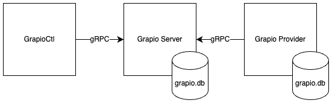

[Grapio](https://grapio.net) is an [OpenFeature](https://openfeature.dev/) provider for .NET that evaluates feature flags.

## Features
* Feature flag evaluation
* Updates to feature flags
* Configurable refresh intervals for the Grapio Provider
* Online and offline mode

## Architecture
Grapio is a feature flag evaluation system that consists of three major components viz. **GrapioCtl**, **Grapio Server** and the **Grapio Provider**. GrapioCtl is a command-line utility that is used to set and unset feature flags. The Grapio Server serves feature flags values and stores them in a SQLite database. The Grapio Provider implements the [OpenFeature Specification](https://openfeature.dev/specification/) and [Evaluation API](https://openfeature.dev/docs/reference/concepts/evaluation-api).

## Example configuration
To configure the Grapio provider, use the extension method `AddGrapio()` which will register the GrapioProvider service and its configuration GrapioConfiguration as singletons. `AddGrapio()` will validate the configuration and throw a ValidationException if it fails.

Below is an example configuration of the Grapio Provider:

~~~csharp
host.Services.AddGrapio(config =>
{
    config.Offline = true;
    config.RefreshInterval = 300;
    config.Requester = "GrapioProvider";
    config.ServerUri = new Uri("http://localhost:3278");    
    config.ConnectionString = "Data Source=grapio.db;";
});
~~~
